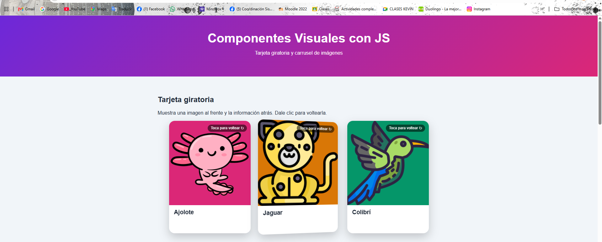
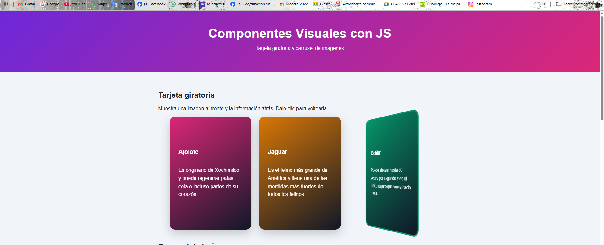
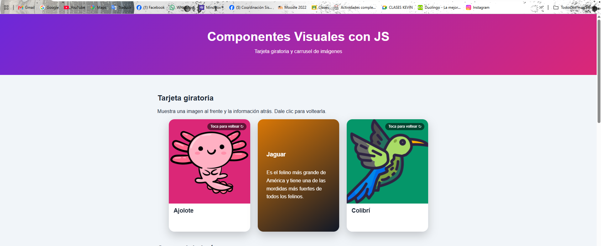
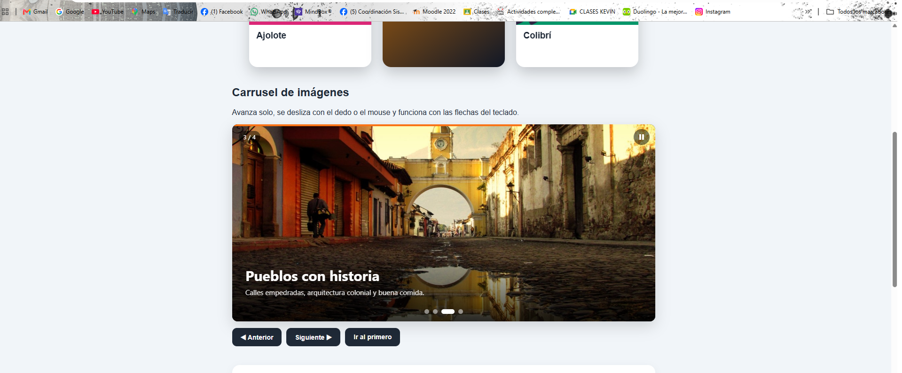
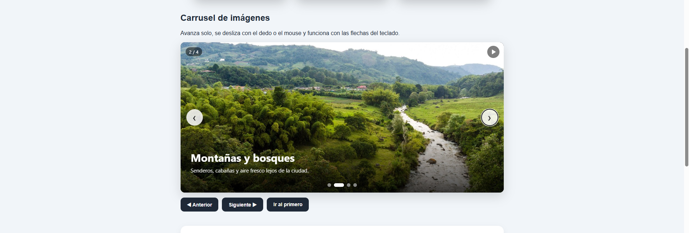
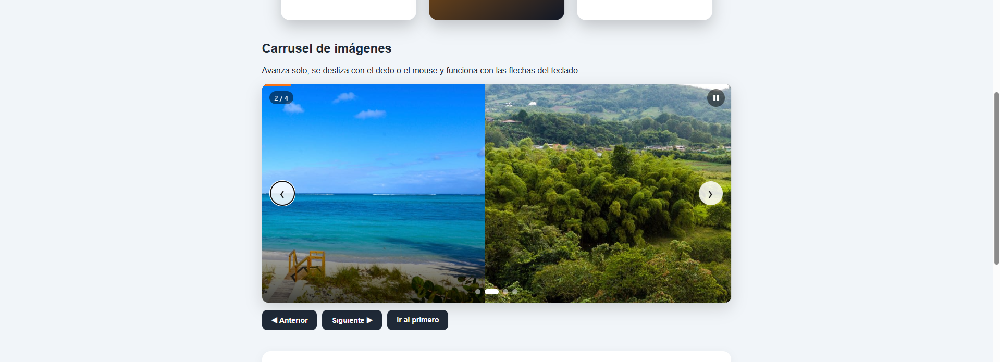
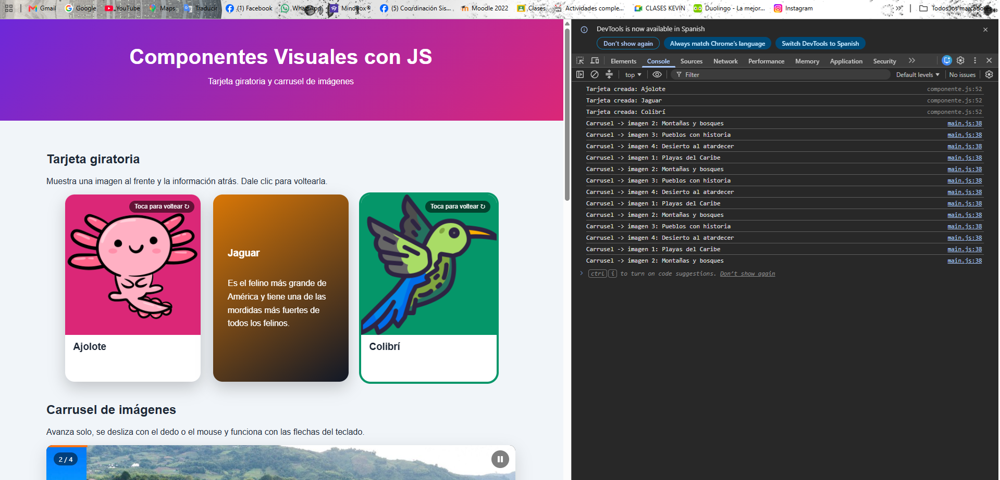
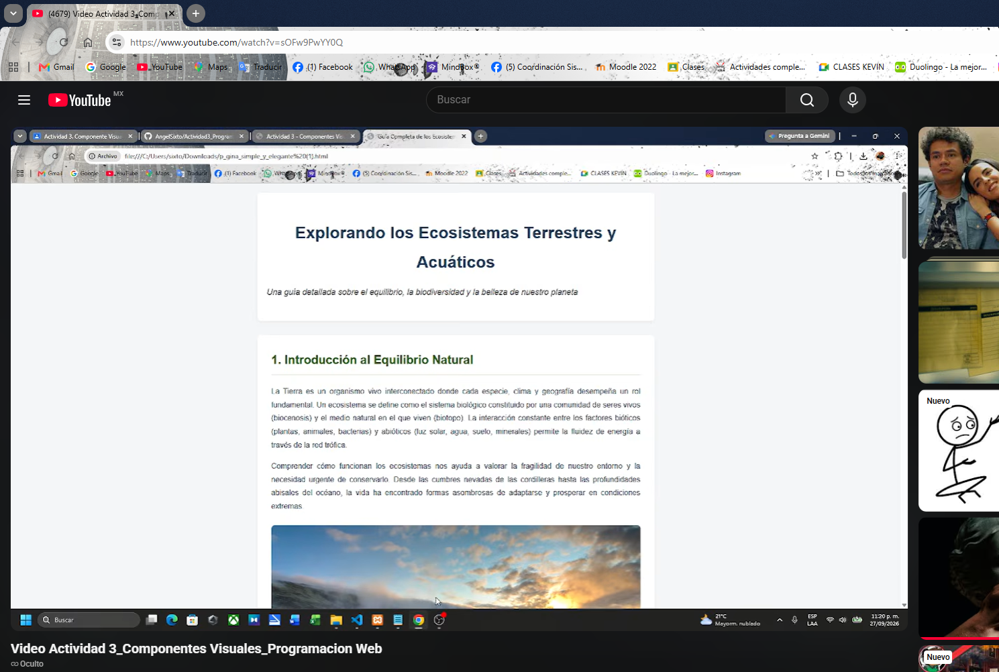

## Autor

**ANGEL SIXTO MORALES** · Actividad 3. Componente Visual con JS

# Tarjeta Giratoria y Carrusel de Imágenes

Librería de **componentes visuales en JavaScript puro** (sin React, Vue ni frameworks).

**Demo en vivo:** https://angelsixto.github.io/Actividad3_Programacion-Web/

---

## ¿Qué problema resuelve?

- **Tarjeta giratoria:** cuando tienes mucha información en poco espacio. Al frente se ve una imagen llamativa y atrás el detalle. Sirve para tarjetas de estudio, productos, integrantes de un equipo o datos curiosos.
- **Carrusel de imágenes:** mostrar varias imágenes (destinos, productos, noticias) sin ocupar toda la página. Avanza solo, se desliza con el dedo y tiene flechas, puntos y miniaturas.

---

## Estructura

```
Actividad3/
├── README.md
├── index.html
├── css/
│   ├── componente.css   ← estilos de los componentes
│   └── estilos.css      ← estilos de la página de demostración
├── js/
│   ├── componente.js    ← lógica de los componentes
│   └── main.js          ← código de la demo (aquí se usan los componentes)
└── img/
```

---

## Instalación

1. Copia los archivos `css/componente.css` y `js/componente.js` a tu proyecto.
2. Incluye el CSS dentro del `<head>`:

```html
<link rel="stylesheet" href="css/componente.css">
```

3. Incluye el JS antes de cerrar el `<body>`:

```html
<script src="js/componente.js"></script>
```

¡Listo! Ya tienes disponible el objeto global.

---

## Uso: Tarjeta giratoria

**1. Crea un contenedor vacío:**

```html
<div id="tarjeta1"></div>
```

**2. Llama la función con tu contenido:**

```javascript
crearTarjeta('#tarjeta1', {
  imagen: 'img/tarjeta-ajolote.jpg',
  titulo: 'Ajolote',
  texto: 'Es originario de Xochimilco y puede regenerar partes de su cuerpo.',
  color: '#db2777'
});
```

**Reutilización:** la misma función con otro contenido.

```javascript
crearTarjeta('#tarjeta2', {
  imagen: 'img/tarjeta-jaguar.jpg',
  titulo: 'Jaguar',
  texto: 'Es el felino más grande de América.',
  color: '#d97706'
});
```

| Parámetro | Descripción |
|---|---|
| `imagen` | Ruta de la imagen del frente |
| `titulo` | Título de la tarjeta |
| `texto` | Información de la parte trasera |
| `color` | Color del reverso |

**Interacción:** se inclina al pasar el mouse y se voltea con clic o con la tecla Enter.

---

## Uso: Carrusel de imágenes

**1. Crea un contenedor vacío:**

```html
<div id="carruselDestinos"></div>
```

**2. Crea el carrusel con tus imágenes:**

```javascript
const destinos = new Carrusel('#carruselDestinos', {
  altura: '420px',
  intervalo: 5000,
  slides: [
    { imagen: 'img/destino-1.jpg', titulo: 'Playas del Caribe', texto: 'Arena blanca y agua turquesa.' },
    { imagen: 'img/destino-2.jpg', titulo: 'Montañas y bosques', texto: 'Senderos y aire fresco.' },
    { imagen: 'img/destino-3.jpg', titulo: 'Pueblos con historia', texto: 'Calles empedradas.' }
  ],
  alCambiar: (i, slide) => console.log('Ahora se ve:', slide.titulo)
});
```

**Reutilización:** el mismo componente con otras imágenes y otras opciones, por ejemplo una galería con miniaturas y sin avance automático.

```javascript
new Carrusel('#otraGaleria', {
  autoplay: false,
  bucle: false,
  miniaturas: true,
  slides: [
    { imagen: 'img/foto1.jpg', titulo: 'Foto 1' },
    { imagen: 'img/foto2.jpg', titulo: 'Foto 2' }
  ]
});
```

**Controlarlo desde tus propios botones:**

```javascript
destinos.siguiente();  // avanza
destinos.anterior();   // retrocede
destinos.irA(0);       // va a la primera imagen
destinos.pausar();     // detiene el avance automático
destinos.reproducir(); // lo reanuda
```

| Parámetro | Por defecto | Descripción |
|---|---|---|
| `slides` | `[]` | Lista de `{ imagen, titulo, texto, enlace }` |
| `autoplay` | `true` | Avanza solo |
| `intervalo` | `5000` | Milisegundos entre imágenes |
| `flechas` | `true` | Muestra flechas laterales |
| `puntos` | `true` | Muestra indicadores inferiores |
| `miniaturas` | `false` | Muestra miniaturas debajo |
| `bucle` | `true` | Al llegar al final regresa al inicio |
| `altura` | `'400px'` | Altura del carrusel |
| `alCambiar` | `null` | Función que se ejecuta al cambiar de imagen |

**Interacción:**
- Clic en flechas, puntos o miniaturas
- Deslizar con el dedo o arrastrar con el mouse
- Flechas ← → del teclado
- Se pausa al pasar el mouse y tiene botón de pausa
- Barra de tiempo que indica cuándo cambia la imagen

---

## Capturas de pantalla

### Tarjetas





### Carrusel




### Consola


---

## Video demo

[](https://youtu.be/TU-VIDEO)

---
